# safety-edge-service
Een API waarmee een autokeuringsproces gevolgd kan worden.
Het bevat 2 backend-microservices, één voor het beheren van
informatie over de auto en de andere om voertuiginspectiegegevens
te beheren.

### car-info-service
https://github.com/AlbertBaffour/car-info-service

### inspection-service
https://github.com/AlbertBaffour/car-inspection-service

## Postman Requests
#### CARS
GET Request - Cars (all)
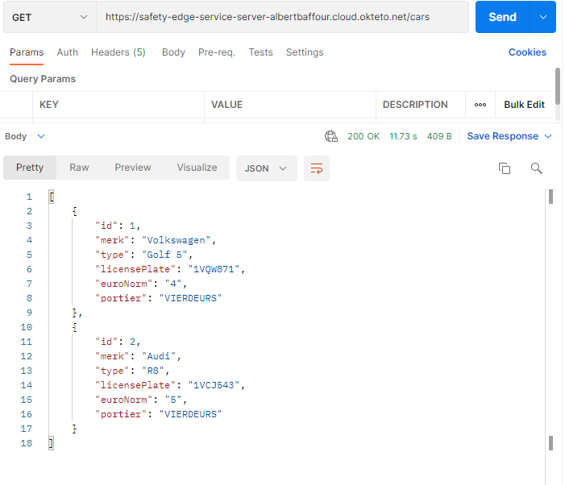

GET Request - Cars By LicencePlate
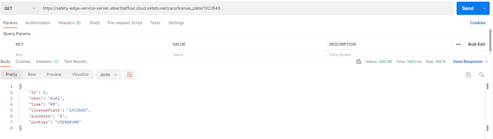

GET Request - Cars By Merk
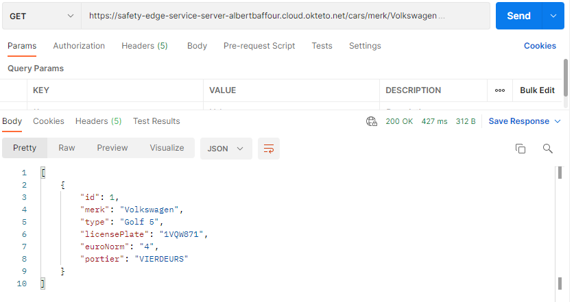

GET Request - Cars By Portier
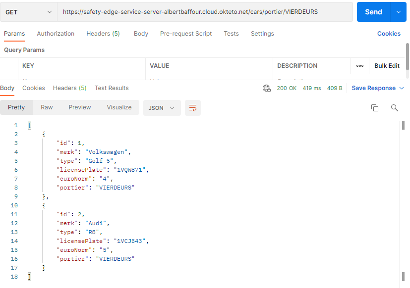

POST Request - Add Car
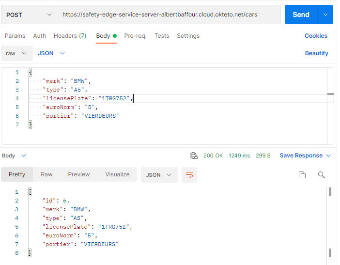

PUT Request - Update Car
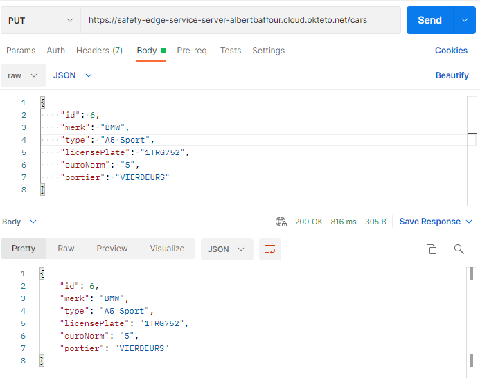

DELETE Request - Delete car
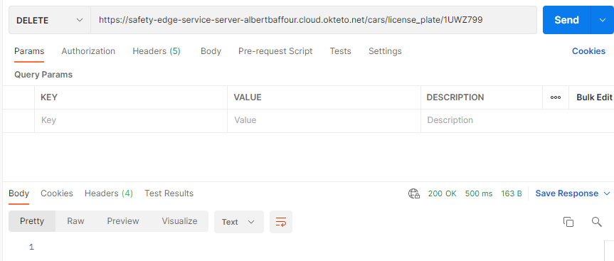

#### CAR INSPECTION

GET Request - Inpections (all)
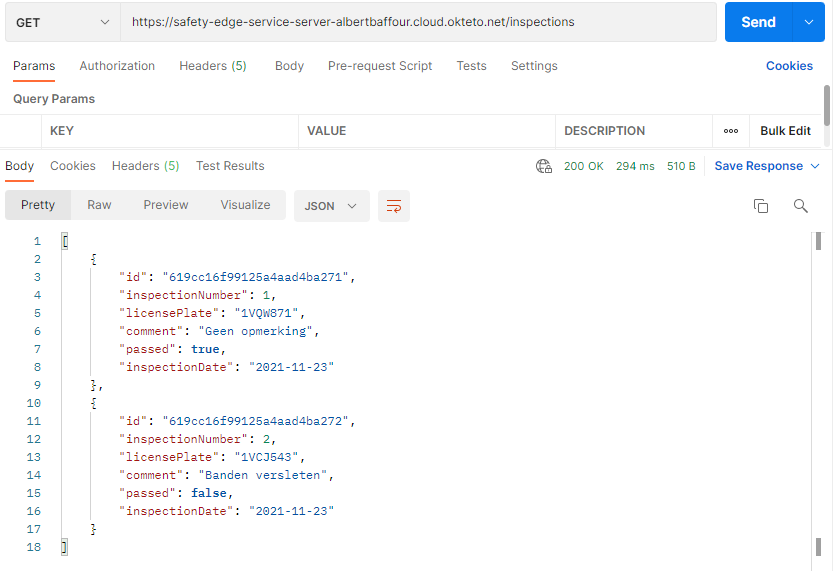

GET Request - Inspections By LicensePlate
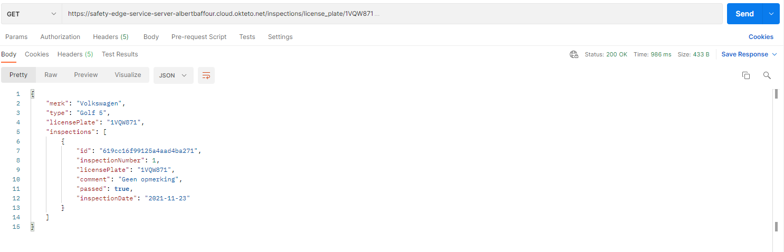

GET Request - Inspections By LicensePlate and Date
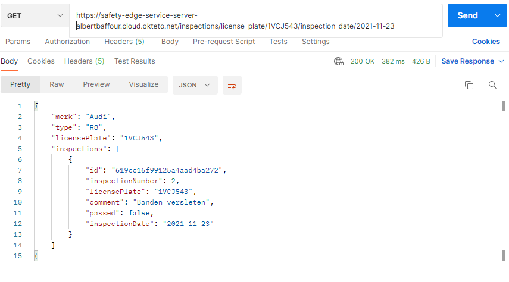

POST Request - Add Inspection
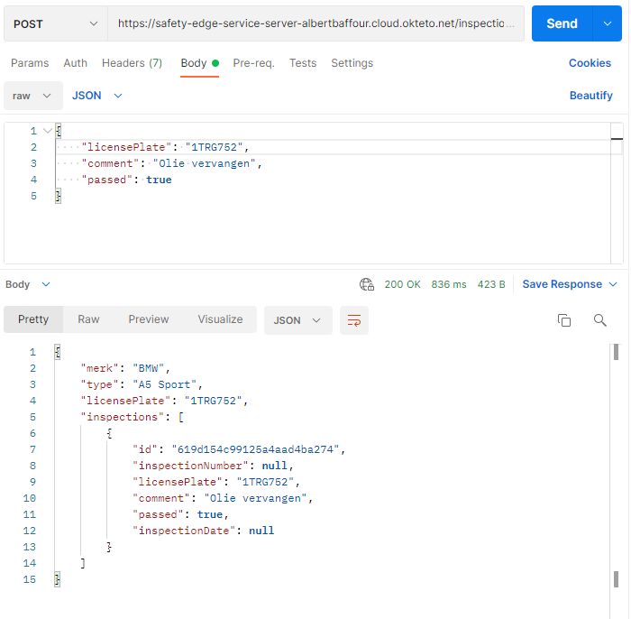

PUT Request - Update Inspection
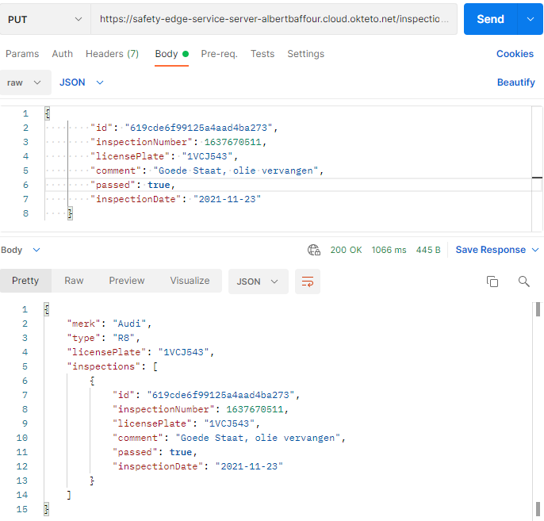

DELETE Request - Delete Inspection
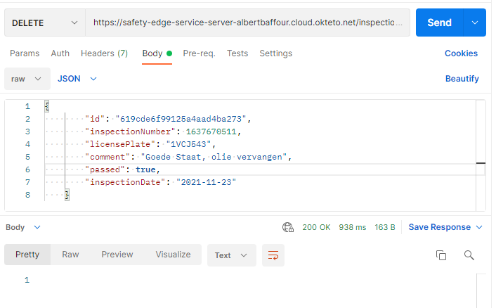

## Swagger UI

