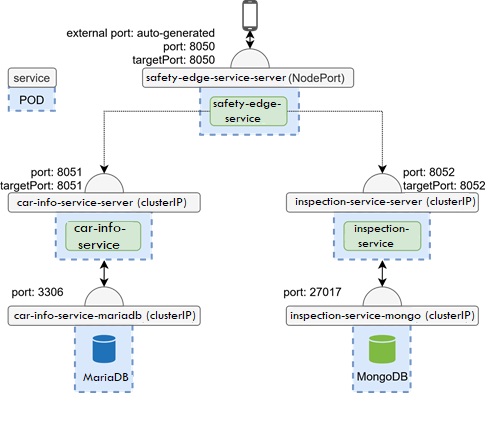
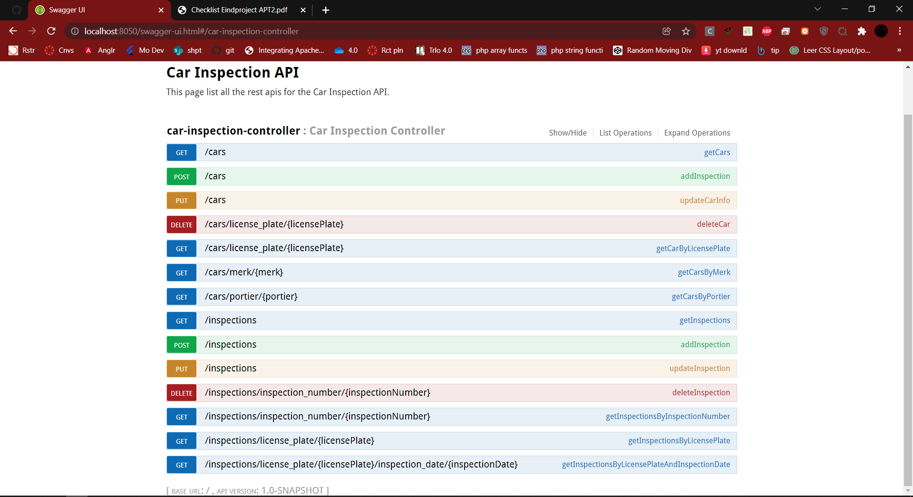

# safety-edge-service
Een API waarmee een autokeuringsproces gevolgd kan worden.
Het bevat 2 backend-microservices, één voor het beheren van
informatie over de auto en de andere om voertuiginspectiegegevens
te beheren.

### car-info-service
https://github.com/AlbertBaffour/car-info-service

### inspection-service
https://github.com/AlbertBaffour/car-inspection-service

## Postman Requests

## Swagger UI

